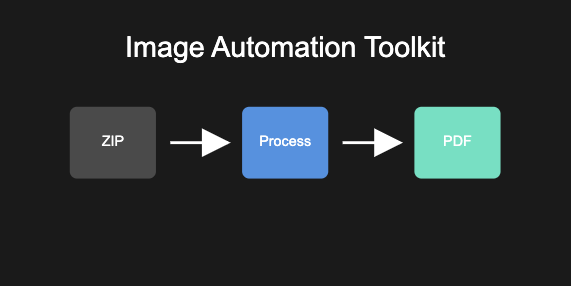

# Image Automation Toolkit

[](https://opensource.org/licenses/MIT)

A professional-grade Python toolkit for automated batch processing of images, featuring ZIP extraction, format conversion, and PDF generation. This toolkit streamlines the workflow of handling large batches of images, making it perfect for digital archiving, document processing, and automated workflow systems.



## 🌟 Features

- **Batch ZIP Processing**: Automatically extract and process multiple ZIP files
- **Smart Image Conversion**: Convert PNG images to optimized JPG format
- **Automated PDF Generation**: Create organized PDFs from processed images
- **Robust Error Handling**: Comprehensive error management and logging
- **Progress Tracking**: Detailed logging of all operations
- **Cross-Platform**: Works on Windows, macOS, and Linux

## 🚀 Quick Start

```bash
# Clone the repository
git clone https://github.com/yourusername/image-automation-toolkit.git

# Install required packages
pip install -r requirements.txt

# Run the demo
python examples/demo_usage.py
```

## 💡 Usage Examples

### Basic Usage
```python
from image_automation_toolkit import BatchProcessor, ImageConverter, PDFGenerator

# Initialize components
processor = BatchProcessor()
converter = ImageConverter()
pdf_gen = PDFGenerator()

# Process directory
processed_dirs = processor.process_directory()

# Convert images and generate PDFs
for dir_name in processed_dirs:
    converter.convert_directory(dir_name)
    pdf_gen.create_pdf(dir_name, dir_name)
```

### Custom Directory Processing
```python
# Process specific directory
processor = BatchProcessor(working_dir="/path/to/directory")
processor.process_directory()
```

## 🛠️ Technical Details

### Components

1. **BatchProcessor**
   - Handles ZIP file extraction
   - Manages workflow coordination
   - Provides progress tracking

2. **ImageConverter**
   - Converts PNG to optimized JPG
   - Handles image format transformation
   - Maintains image quality

3. **PDFGenerator**
   - Creates PDFs from processed images
   - Supports multiple image formats
   - Maintains original image order

## 📋 Requirements

- Python 3.7+
- Pillow>=9.0.0
- img2pdf>=0.4.0

## 🤝 Contributing

Contributions are welcome! Please feel free to submit a Pull Request.

## 📄 License

This project is licensed under the MIT License - see the [LICENSE](LICENSE) file for details.